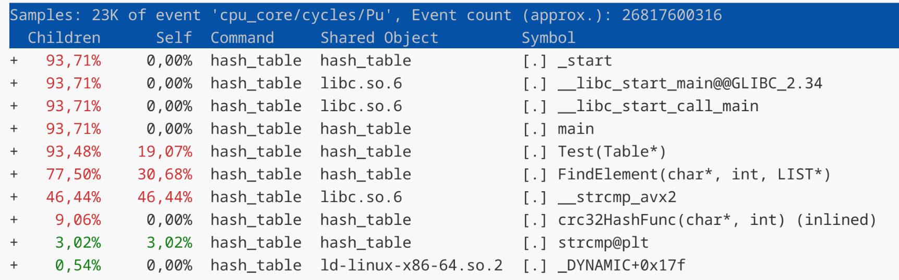
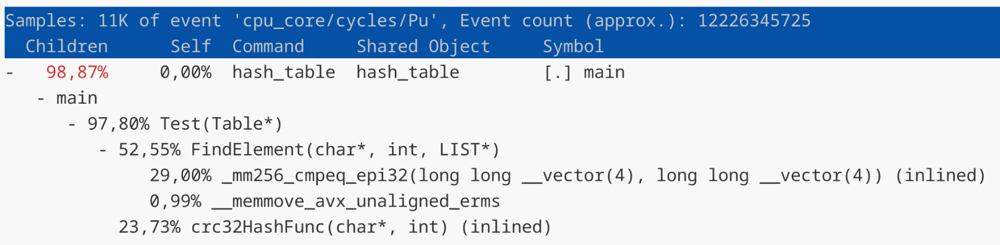

# HashTable

## Характеристики тестовой машины

Intel(R) Core(TM) Ultra 7 155H

CPU average MHz: 4000

Тесты проводились с включенным зарядным устройством.

## Теоретические сведения

### Хеш функция
Хэш-функция — это функция, которая преобразует любые цифровые данные в выходную строку с фиксированным количеством символов. Мы говорим, что элемент с ключом $k$ хешируется в ячейку $h(k)$, т.е. мы используем хеш-функцию $h$ для вычисления ячейки для данного ключа $k$. (Рис. 1.)
Функция $h$ отображает совокупность ключей $U$ на ячейки хеш-таблицы $T[0..m-1]:$
$$
h: U → {0,1,...,m-1},
$$
где размер $m$ хеш-таблицы обычно гораздо меньше значения $|U|$. 


Рис. 1. Хеш функция. Иллюстрация взята из [1].

Коллизия - несколько ключей отображается в один и тот же индекс массива. В данном случае $k_2$ и $k_5$ отображаются в одну ячейку.

### Разрешение коллизий с помощью метода цепочек
При разрешении коллизий с помощью цепочек мы помещаем все элементы, хешированные в одну и ту же ячейку, в связанный список. (Рис. 2.) Ячейка j содержит указатель на заголовок списка всех элементов, хеш-значение ключа которых равно j; если таких элементов нет, ячейка содержит значение NULL.


Рис. 2. Метод цепочек. Иллюстрация взята из [1].

Каждая ячейка хеш-таблицы $T[j]$ содержит
связанный список всех ключей с хеш-значением j. Например, $h(k_1) = h(k_4), h(k_5) = h(k_2) = h(k_7).$

### Коэффициент заполнения (load factor)
Определим коэффициент заполнения $\alpha$ таблицы $Т$ как $\frac{n}{m}$, т.е. как среднее
количество элементов, хранящихся в одной цепочке. $n$ - количество, хранящихся элементов в таблице, $m$ - количество связных списков.

## Задача
Задача работы оптимизировать хеш-таблицу с завышенным значением **load factor**. Будем использовать метод цепочек для решения коллизий. Для данной реализации лучшую производительность дает load factor в диапазоне $[1,3]$. Мы будем использовать хеш-таблицу со значением load factor равным $15$. Use case для оптимизации будет являться одна загрузка данных в таблицу и большое количество поиска слов. В хеш-таблице помимо самих слов будет лежать и количество их повторений, т.е. получится частотный словарь. В качестве данных для хеширования будем использовать произведение "Война и мир". В качестве данных для запросов будем использовать системный файл *linux.words*.

### Характеристики хешируемого текста
| | |
|:-:|:-:|
| Общее количество слов | $562 185$ |
| Уникальных слов | $22 259$ |

Исходя из этих данных выберем размер таблицы простым числом **1483**, для того чтобы **load factor** был равен **15**. 

### Use case
1 загрузка $562 185$ слов. 

$47982500$ запросов к таблице на поиск слова.

## Исследование хеш-функций
Оцениваем функции по визуально по графикам, а также посчитаем дисперсию высот столбиков по формуле $\mathbb{D}\xi = \mathbb{E}(\xi ^ 2) - (\mathbb{E}\xi)^2$. $\mathbb{E}\xi = 15, \mathbb{E}(\xi ^ 2) = \frac{1}{1483}\sum_{i=1}^{1483} h_i^2.$

### Длина строки. (Рис. 3.)


Рис. 3. Длина строки.

### Сумма ASCII кодов букв. (Рис. 4.)


Рис. 4. Сумма ASCII кодов букв.

### Murmur хеш. (Рис. 5.) [Описание](https://en.wikipedia.org/wiki/MurmurHash "Murmur")


Рис. 5. Murmur хеш.

### Полиномиальный хеш. (Рис. 6.) [Описание](https://ru.algorithmica.org/cs/hashing/polynomial/ "Полиномальный")


Рис. 6. Полиномиальный хеш.

### crc32. (Рис. 7.) [Описание](https://github.com/gcc-mirror/gcc/blob/master/libiberty/crc32.c "crc32")


Рис. 7. crc32.

| | Хеш функция | $\mathbb{D}\xi$ |
|:--------:|:-----------:|:------:|
| 1 | Длина строки | 32925.14 |
| 2 | Сумма ASCII кодов букв | 252.06 |
| 3 | Murmur хеш | 16.03 |
| 4 | Полиномиальный | 15.63 |
| 5 | crc32 | 14.13 |

Остановимся на хеш-функции с наилучшими результатами - **crc32**.

## Результаты

Компиляция происходила с флагом $-O3$. Время выполнения измеряется всей программы в тиках процессора с помощью **__rdtsc ()**.

### Обработка результатов

Запуск программы происходил $n = 20$ раз. Время измерялось в тиках процессора. Расчеты происходили по следующим формулам:

$$
\langle t \rangle = \frac{1}{n}\sum_{i=1}^n t_i
$$

$$
\sigma_t = \sqrt{\frac{1}{n}\sum_{i=1}^n (t_i - \langle t \rangle)^2}
$$

$$
\sigma_{cp} = \frac{\sigma_t}{\sqrt{n}}
$$

$$
\varepsilon_t = \frac{\sigma_{cp}}{\langle t \rangle} \cdot 100\%
$$

$$
t = \langle t \rangle ± \sigma_{cp}
$$

### Запуск 1 (без оптимизаций)

Проведем запуск начальной версии программы, которая не содержит никаких оптимизаций.

#### Результаты

<details>
  <summary>Посмотреть данные</summary>

|Номер измерения |Время, тики |
|:-:|:-:|
|$t_1$    |17453254923|
|$t_2$    |17735716232|
|$t_3$    |17495298507|
|$t_4$    |17398450056|
|$t_5$    |17311463366|
|$t_6$    |17442219420|
|$t_7$    |17557579741|
|$t_8$    |17630493839|
|$t_9$    |17343682360|
|$t_{10}$ |17350889529|
|$t_{11}$ |17601048369|
|$t_{12}$ |17681517527|
|$t_{13}$ |17683704188|
|$t_{14}$ |17713193522|
|$t_{15}$ |17439706662|
|$t_{16}$ |17438478128|
|$t_{17}$ |17645289967|
|$t_{18}$ |17372628168|
|$t_{19}$ |17611274579|
|$t_{20}$ |17084638759|

</details>

| $\langle t \rangle$, тик | $\sigma_t$, тик | $\sigma_{cp}$, тик | $\varepsilon_t$ | $t$, тик |
|:----:|:---:|:---:|:---:|:---:|
|$17499526392$|$166384650$|$37204739$|$0,21\%$|$(17,50 ± 0,04) \cdot 10^9$|

#### Perf
<!--  -->


Рис. 8. Запуск 1.

### Запуск 2 (оптимизация FindElement и strcmp)

По отчету профилировщика (Рис. 8.) горячей точкой является функция **FindElement** и вызываемая в ней **strcmp**, поэтому приступим к их оптимизации.
Заменим **strcmp** на SIMD инструкции. Искомую строку будем загружать в **__m256i** только один раз перед циклом. Цикл проходится по списку. Для такой реализации необходимо чтобы каждый список был выровнен по 32-байтовой границе, иначе будет segmentation fault.

```
// исходный 
for ()
{
  if (!strcmp (list->data[i].str, value))
    return list->data[i].n_repeat;
  ...
}

// оптимизированный
uint8_t buf[32] = {};
memcpy (buf, value, len);
__m256i vec = _mm256_loadu_si256 ((__m256i*) buf);

for ()
{
  __m256i cmp = _mm256_cmpeq_epi32 (vec, list->data[i].avx);
  int mask    = _mm256_movemask_epi8 (cmp);  

  if (mask == 0xFFFFFFFF)
    return list->data[i].n_repeat;
}
```
#### Результаты

<details>
  <summary>Посмотреть данные</summary>

|Номер измерения |Время, тики |
|:-:|:-:|
|$t_{1  }$|8179294983|
|$t_{2  }$|8071579155|
|$t_{3  }$|8032195144|
|$t_{4  }$|8061217418|
|$t_{5  }$|8083556033|
|$t_{6  }$|8050124942|
|$t_{7  }$|8088366630|
|$t_{8  }$|8161757281|
|$t_{9  }$|8085109057|
|$t_{10 }$|8046539309|
|$t_{11 }$|8090590291|
|$t_{12 }$|8102750737|
|$t_{13 }$|8110495105|
|$t_{14 }$|8446868934|
|$t_{15 }$|8048978805|
|$t_{16 }$|7976661243|
|$t_{17 }$|8032484858|
|$t_{18 }$|7950303139|
|$t_{19 }$|7910392967|
|$t_{20 }$|8378886373|

</details>

| $\langle t \rangle$, тик | $\sigma_t$, тик | $\sigma_{cp}$, тик | $\varepsilon_t$ | $t$, тик |
|:----:|:---:|:---:|:---:|:---:|
|$8095407620$|$125990400$|$28172310$|$0,35\%$|$(8,10 ± 0,03) \cdot 10^9$|

#### Perf
<!--  -->


Рис. 9. Запуск 2.

#### Итог
Удалось увеличить скорость выполнения на $53,7\%$ относительно предыдущего запуска. Оставляем данную оптимизацию.

### Запуск 3 (выравнивание)
 
В отчете perf (Рис. 9.) видно что вызывается функция **__memmove_avx_unaligned_erms**, которая позволяет копировать данные несмотря на выравнивание. Попробуем копировать данные из невыровненного буфера в выровненный. Для этого выровняем буфер в который копируем, заменим функцию загрузки **loadu** -> **load**.

```
alignas (32) uint8_t buf[32] = {};
memcpy (buf, value, len);
__m256i vec = _mm256_load_si256 ((__m256i*) buf);
```
#### Perf


Рис. 10. Запуск 3.

#### Итог
Общее время выполнения не изменилось, поэтому нет смысла делать выравнивание в этом случае. Оставляем функцию **_mm256_loadu_si256**. Необходимо только выравнивание списков для хранения строк в формате **__m256i**.

### Запуск 4 (static inline FindElement)

Сделаем inline функции, на которую уходит больше половины времени выполнения функции **Test**. (Рис. 10.)

#### Perf


Рис. 11. Запуск 4.

#### Итог
Время выполнения не изменилось, поэтому не будем оставлять данную оптимизацию.

### Запуск 5 (оптимизация crc32)

Следующая по очереди (Рис. 11.) функция для оптимизации - **crc32**. Используем ассемблерную вставку для оптимизации. Заменим нашу функцию **crc32**, работающую со статической таблицей, на ассемблерную инструкцию. Будем обрабатывать строки по $4$ символа за один раз.

```
// исходный
while (buf[n])
{
  crc = (crc << 8) ^ crc32_table[((crc >> 24) ^ (unsigned) buf[n]) & 255];
  n++;
}

// оптимизированный
asm 
(
  ".intel_syntax noprefix                \n\t"
  "       mov eax, -1                    \n\t"    
  "       mov rsi, %[buf]                \n\t"        
  "       mov ecx, %[len]                \n\t"
        
  "1:     cmp ecx, 4                     \n\t"
  "       jb 3f                          \n\t"
        
  "       crc32 eax, dword ptr [rsi]     \n\t"
  "       add rsi, 4                     \n\t"
  "       sub ecx, 4                     \n\t"
  "       jmp 1b                         \n\t"
        
  "3:     test ecx, ecx                  \n\t"           
  "       jz 2f                          \n\t"                   
        
  "4:     crc32 eax, byte ptr [rsi]      \n\t" 
  "       inc rsi                        \n\t"                 
  "       dec rcx                        \n\t"                  
  "       jnz 4b                         \n\t"                   
        
  "2:     xor eax, -1                    \n\t"     
  "       mov %[crc], eax                \n\t"  

  ".att_syntax prefix                    \n\t"
  : [crc] "=r" (crc)
  : [buf] "r" (buf), [len] "r" (len)
  : "rax", "rcx", "rsi", "cc", "memory"
);
```

#### Результаты

<details>
  <summary>Посмотреть данные</summary>

|Номер измерения |Время, тики |
|:-:|:-:|
|$t_{1} $|5860510679|
|$t_{2} $|5728193338|
|$t_{3} $|5704987946|
|$t_{4} $|5714056019|
|$t_{5} $|5711553174|
|$t_{6} $|5854082933|
|$t_{7} $|5815229203|
|$t_{8} $|5866243115|
|$t_{9} $|5863485018|
|$t_{10}$ |5793117547|
|$t_{11}$ |5851516154|
|$t_{12}$ |5860833565|
|$t_{13}$ |5886068439|
|$t_{14}$ |5759982821|
|$t_{15}$ |5834903810|
|$t_{16}$ |5855912834|
|$t_{17}$ |5874179433|
|$t_{18}$ |5793835793|
|$t_{19}$ |5755881136|
|$t_{20}$ |5823154499|

</details>

| $\langle t \rangle$, тик | $\sigma_t$, тик | $\sigma_{cp}$, тик | $\varepsilon_t$ | $t$, тик |
|:----:|:---:|:---:|:---:|:---:|
|$5810386373$|$60806406$|$13596726$|$0,23\%$|$(5,81 ± 0,01) * 10^9$|

#### Perf
<!--  -->


Рис. 12. Запуск 5.

#### Итог
Удалось увеличить скорость выполнения на $28,27\%$ относительно $2$ запуска. Оставляем данную оптимизацию.

### Запуск 6 (попытка оптимизации crc32)

Попробуем еще оптимизировать вычисление хеша. Такой версией, которая не содержит циклов. 
```
uint8_t value[32] = {};
memcpy (value, buf, len);

crc = _mm_crc32_u64 (crc, *((uint64_t*)  value));
crc = _mm_crc32_u64 (crc, *(((uint64_t*) value)+1));    
crc = _mm_crc32_u64 (crc, *(((uint64_t*) value)+2));    
crc = _mm_crc32_u64 (crc, *(((uint64_t*) value)+3));    

```
#### Perf


Рис. 13. Запуск 6.

#### Godbolt
```
crc32HashFunc(char*, int):
  push    rbp
  vpxor   xmm0, xmm0, xmm0
  movsx   rdx, esi
  mov     rsi, rdi
  mov     rbp, rsp
  and     rsp, -32
  sub     rsp, 32
  vmovdqa YMMWORD PTR [rsp], ymm0
  mov     rdi, rsp
  vzeroupper
  call    memcpy
  mov     eax, -1
  crc32   rax, QWORD PTR [rsp]
  crc32   rax, QWORD PTR [rsp+8]
  crc32   rax, QWORD PTR [rsp+16]
  crc32   rax, QWORD PTR [rsp+24]
  leave
  ret
```

#### Итог

По отчету (Рис. 13.) видно, что почти все время уходит на функцию **_mm_crc32_u64**. Средняя длина слов - $4,68$ букв, но всегда происходит расчет для $32$ букв. Следовательно вариант с циклами в этом случае выигрывает, потому что не происходит лишних расчетов. К тому же отсутствует конвейеризация при использовании _mm_crc32_u64. 

### Запуск 7 (попытка оптимизации crc32)

Eще раз попробуем оптимизировать вычисление хеша без циклов ассемблерной вставкой. Сделано ради интереса сравнить два варианта одного кода.

```
uint8_t value[32] = {};
memcpy (value, buf, len % 31);

asm 
(
    ".intel_syntax noprefix                \n\t"
    "       mov rax, -1                    \n\t"    
    "       mov rsi, %[buf]                \n\t"        
    
    "       crc32 rax, qword ptr [rsi]     \n\t"
    "       add rsi, 8                     \n\t"
    "       crc32 rax, qword ptr [rsi]     \n\t"
    "       add rsi, 8                     \n\t"
    "       crc32 rax, qword ptr [rsi]     \n\t"
    "       add rsi, 8                     \n\t"
    "       crc32 rax, qword ptr [rsi]     \n\t"

    "       xor rax, -1                    \n\t"     
    "       mov %[crc], rax                \n\t"  

    ".att_syntax prefix                    \n\t"
    : [crc] "=r" (crc)
    : [buf] "r" (value)
    : "rax", "rsi", "cc", "memory"
);
```
#### Perf


Рис. 14. Запуск 7.

#### Итог

Результат такой же как и в $6$ запуске. 

### Запуск 8 (последняя попытка оптимизировать crc32)

Перепишем функция полностью на ассемблере и слинкуем при сборке бинарников. 

```
my_crc32:
      push rsi 
      push rdi                      

      mov eax, -1

  .1: cmp edi, 4
      jb .3

      crc32 eax, dword [rsi]
      add rsi, 4
      sub edi, 4
      jmp .1

  .3: test edi, edi
      jz .2

  .4: crc32 eax, byte [rsi]
      inc rsi
      dec edi
      jnz .4

  .2: xor eax, -1
      
      pop rdi                        
      pop rsi
                  
      ret
```
#### Perf


Рис. 15. Запуск 8.

#### Итог

Результат получился такой же как и в $5$ версии. Нет смысла оставлять этот вариант, лучше оставим ассемблерную вставку в силу своей простоты, по сравнению с отдельным ассемблерным файлом.

## Итоговое ускорение

|Версия | Относительно 1 запуска |
| :-: | :-: |
| 1 | 0 % |
| 2 | + 53,7% |
| 5 | + 66,8% |

## КПД оптимизаций 

$\alpha = \frac{\text{коэффициент ускорения}}{\text{количество asm строк}} = \frac{3.02}{22} \cdot 100\%$

## Литература 
1. Кормен, Томас X. и др. Алгоритмы: построение и анализ, 3-е изд. : Пер. с англ. — М. : ООО
“И. Д. Вильямс”, 2013. — 1328 с. : ил. — Парал. тит. англ.
2. Hash Function: [Электронный ресурс]. URL: https://corporatefinanceinstitute.com/resources/cryptocurrency/hash-function/ (Дата обращения 30.04.2025)
3.  perf: Linux profiling with performance counters: [Электронный ресурс]. URL: https://perfwiki.github.io/main/ (Дата обращения 30.04.2025)
4. MurmurHash: [Электронный ресурс]. URL: https://en.wikipedia.org/wiki/MurmurHash (Дата обращения 30.04.2025)
5. Полиномиальное хеширование: [Электронный ресурс]. URL: https://ru.algorithmica.org/cs/hashing/polynomial/ (Дата обращения 30.04.2025)
6. crc32.c: [Электронный ресурс]. URL: https://github.com/gcc-mirror/gcc/blob/master/libiberty/crc32.c (Дата обращения 30.04.2025)