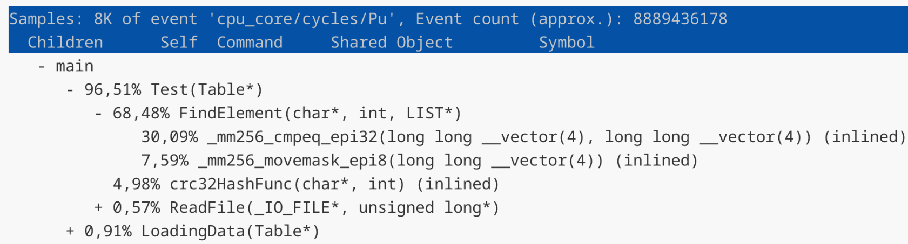

# HashTable

## Описание
Задача работы оптимизировать хеш-таблицу с завышенным **load-factor**. Будем использовать метод цепочек для решения коллизий. Для данной реализации лучшую производительность дает load-factor в диапазоне $[1,3]$. Мы будем использовать хеш-таблицу с load-factor равным $15$. Use-case для оптимизации будет являться одна загрузка данных в таблицу и большое количество поиска слов. В хеш-таблице помимо самих слов будет лежать и количество их повторений, т.е. получится частотный словарь. В качестве данных для хеширования будем использовать произведение "Война и мир". В качестве данных для запросов будем использовать системный файл *linux.words*.

### Характеристики хешируемого текста
| | |
|:-:|:-:|
| Общее количество слов | $562 185$ |
| Уникальных слов | $22 259$ |

Исходя из этих данных выберем размер таблицы простым числом **1483**, для того чтобы **load-factor** был равен **15**. 

### Use-case
1 загрузка $562 185$ слов. 

$47982500$ запросов на поиск слова.

## Исследование хеш-функций
Оцениваем функции по визуально по графикам, а также посчитаем дисперсию высот столбиков по формуле $\mathbb{D}\xi = \mathbb{E}(\xi ^ 2) - (\mathbb{E}\xi)^2$. $\mathbb{E}\xi = 15, \mathbb{E}(\xi ^ 2) = \frac{1}{1483}\sum_{i=1}^{1483} h_i^2.$

### Длина строки.


### Сумма букв строки.


### Murmur хеш.


### Полиномиальный хеш.


### crc32.


| | Хеш функция | $\mathbb{D}\xi$ |
|:--------:|:-----------:|:------:|
| 1 | Длина строки | 32925.14 |
| 2 | Сумма букв | 252.06 |
| 3 | Murmur хеш | 16.03 |
| 4 | Полиномиальный | 15.63 |
| 5 | crc32 | 14.13 |

Остановимся на хеш функции с наилучшими результатами - **crc32**.

## Результаты

Компиляция происходила с флагом $-O3$. Время выполнения измеряется всей программы в тиках процессора с помощью **__rdtsc ()**.

### Запуск 1 (без оптимизаций)
<details>
  <summary>Посмотреть данные</summary>

| | |
|:-:|:-:|
|1 |17453254923|
| 2|17735716232|
|3 |17495298507|
|4 |17398450056|
|5 |17311463366|
|6 |17442219420|
|7 |17557579741|
|8 |17630493839|
|9 |17343682360|
|10 |17350889529|
|11 |17601048369|
|12 |17681517527|
|13 |17683704188|
|14 |17713193522|
|15 |17439706662|
|16 |17438478128|
|17 |17645289967|
|18 |17372628168|
|19 |17611274579|
|20 |17084638759|

</details>

#### Расчеты
$$
\langle t \rangle = \frac{1}{n}\sum_{i=1}^n t_i = 17499526392
$$

$$
\sigma_t = \sqrt{\frac{1}{n}\sum_{i=1}^n (t_i - \langle t \rangle)^2} = 166384650
$$

$$
\sigma_{cp} = \frac{\sigma_t}{\sqrt{n}} = 37204739
$$

$$
t = \langle t \rangle ± \sigma_{cp}, \varepsilon_t = 0,21\%
$$

$$
t = (17,50 ± 0,04) \cdot 10^9
$$

#### Отчет профилировщика


### Запуск 2 (оптимизация strcmp)

#### Оптимизация (с помощью SIMD инструкций)

```
// исходный
if (!strcmp (list->data[i].str, value))
  return list->data[i].n_repeat;

// оптимизированный
alignas(32) uint8_t buf[32] = {};
memcpy (buf, value, len % 31);
__m256i vec = _mm256_load_si256 ((__m256i*) buf);

__m256i cmp = _mm256_cmpeq_epi32 (vec, list->data[i].avx);
int mask    = _mm256_movemask_epi8 (cmp);  

if (mask == 0xFFFFFFFF)
    return list->data[i].n_repeat;
```

<details>
  <summary>Посмотреть данные</summary>

| | |
|:-:|:-:|
|1 |12074201723|
|2 |12002969069|
|3 |12045961879|
|4 |12070437466|
|5 |12107592909|
|6 |12026373199|
|7 |11909498677|
|8 |12062532520|
|9 |12104262736|
|10 |11884264299|
|11 |11718172246|
|12 |12079613631|
|13 |12109074452|
|14 |12101920156|
|15 |11999822995|
|16 |11985528645|
|17 |12208307944|
|18 |12150644266|
|19 |11953972133|
|20 |12140464715|

</details>

#### Расчеты
$$
\langle t \rangle = \frac{1}{n}\sum_{i=1}^n t_i = 12036780783
$$

$$
\sigma_t = \sqrt{\frac{1}{n}\sum_{i=1}^n (t_i - \langle t \rangle)^2} = 110111090
$$

$$
\sigma_{cp} = \frac{\sigma_t}{\sqrt{n}} = 24621588
$$

$$
t = \langle t \rangle ± \sigma_{cp}, \varepsilon_t = 0,20\%
$$

$$
t = (12,04 ± 0,02) \cdot 10^9
$$

#### Отчет профилировщика


#### Результаты
Удалось увеличить скорость выполнения на $31,2\%$ относительно предыдущего запуска.

### Запуск 3 (оптимизация FindElement)

#### Оптимизация (вычисление вне цикла)

```
// исходный 
for (size_t i = 1; i < list->size; i++)
{
  alignas(32) uint8_t buf[32] = {};
  memcpy (buf, value, len % 31);
  __m256i vec = _mm256_load_si256 ((__m256i*) buf);
  ...
}

// оптимизированный
alignas(32) uint8_t buf[32] = {};
memcpy (buf, value, len % 31);
__m256i vec = _mm256_load_si256 ((__m256i*) buf);

for (size_t i = 1; i < list->size; i++)
{
  ...
}
```

<details>
  <summary>Посмотреть данные</summary>

| | |
|:-:|:-:|
|1 |8179294983|
|2 |8071579155|
|3 |8032195144|
|4 |8061217418|
|5 |8083556033|
|6 |8050124942|
|7 |8088366630|
|8 |8161757281|
|9 |8085109057|
|10 |8046539309|
|11 |8090590291|
|12 |8102750737|
|13 |8110495105|
|14 |8446868934|
|15 |8048978805|
|16 |7976661243|
|17 |8032484858|
|18 |7950303139|
|19 |7910392967|
|20 |8378886373|

</details>

#### Расчеты
$$
\langle t \rangle = \frac{1}{n}\sum_{i=1}^n t_i = 8095407620
$$

$$
\sigma_t = \sqrt{\frac{1}{n}\sum_{i=1}^n (t_i - \langle t \rangle)^2} = 125990400
$$

$$
\sigma_{cp} = \frac{\sigma_t}{\sqrt{n}} = 28172310
$$

$$
t = \langle t \rangle ± \sigma_{cp}, \varepsilon_t = 0,35\%
$$

$$
t = (8,10 ± 0,03) \cdot 10^9
$$

#### Отчет профилировщика


#### Результаты
Удалось увеличить скорость выполнения на $32,7\%$ относительно предыдущего запуска.

### Запуск 4 (оптимизация crc32)

#### Оптимизация (ассемблерная вставка)
Заменим нашу функцию **crc32**, работающую со статической таблицей, на ассемблерную инструкцию.

```
// исходный
while (buf[n])
{
  crc = (crc << 8) ^ crc32_table[((crc >> 24) ^ (unsigned) buf[n]) & 255];
  n++;
}

// оптимизированный
asm volatile 
(
  ".intel_syntax noprefix                \n\t"
  "       mov eax, -1                    \n\t"    
  "       mov rsi, %[buf]                \n\t"        
  "       mov ecx, %[len]                \n\t"
        
  "1:     cmp ecx, 4                     \n\t"
  "       jb 3f                          \n\t"
        
  "       crc32 eax, dword ptr [rsi]     \n\t"
  "       add rsi, 4                     \n\t"
  "       sub ecx, 4                     \n\t"
  "       jmp 1b                         \n\t"
        
  "3:     test ecx, ecx                  \n\t"           
  "       jz 2f                          \n\t"                   
        
  "4:     crc32 eax, byte ptr [rsi]      \n\t" 
  "       inc rsi                        \n\t"                 
  "       dec rcx                        \n\t"                  
  "       jnz 4b                         \n\t"                   
        
  "2:     xor eax, -1                    \n\t"     
  "       mov %[crc], eax                \n\t"  

  ".att_syntax prefix                    \n\t"
  : [crc] "=r" (crc)
  : [buf] "r" (buf), [len] "r" (len)
  : "rax", "rcx", "rsi", "cc", "memory"
);
```

<details>
  <summary>Посмотреть данные</summary>

| | |
|:-:|:-:|
|1 |5860510679|
|2 |5728193338|
|3 |5704987946|
|4 |5714056019|
|5 |5711553174|
|6 |5854082933|
|7 |5815229203|
|8 |5866243115|
|9 |5863485018|
|10 |5793117547|
|11 |5851516154|
|12 |5860833565|
|13 |5886068439|
|14 |5759982821|
|15 |5834903810|
|16 |5855912834|
|17 |5874179433|
|18 |5793835793|
|19 |5755881136|
|20 |5823154499|

</details>

#### Расчеты
$$
\langle t \rangle = \frac{1}{n}\sum_{i=1}^n t_i = 5810386373
$$

$$
\sigma_t = \sqrt{\frac{1}{n}\sum_{i=1}^n (t_i - \langle t \rangle)^2} = 60806406
$$

$$
\sigma_{cp} = \frac{\sigma_t}{\sqrt{n}} = 13596726
$$

$$
t = \langle t \rangle ± \sigma_{cp}, \varepsilon_t = 0,23\%
$$

$$
t = (5,81 ± 0,01) * 10^9
$$

#### Отчет профилировщика



#### Результаты
Удалось увеличить скорость выполнения на $28,27\%$ относительно предыдущего запуска.

### Запуск 5 (попытка оптимизации crc32)
Попробуем еще оптимизировать вычисление хеша таким образом. Такой версией, которая не содержит циклов. Однако такая версия ухудшила результаты. Время увеличилось на $17\%$ по сравнению с $4$ запуском.
```
alignas(32) uint8_t value[32] = {};
memcpy (value, buf, len % 31);

crc = _mm_crc32_u64 (crc, *((uint64_t*)  value));
crc = _mm_crc32_u64 (crc, *(((uint64_t*) value)+1));    
crc = _mm_crc32_u64 (crc, *(((uint64_t*) value)+2));    
crc = _mm_crc32_u64 (crc, *(((uint64_t*) value)+3));    

```
### Запуск 6 (попытка оптимизации crc32)
Eще раз попробуем оптимизировать вычисление хеша без циклов ассемблерной вставкой. Результат такой же как и в $5$ тесте.
```
alignas(32) uint8_t value[32] = {};
memcpy (value, buf, len % 31);

asm volatile 
(
    ".intel_syntax noprefix                \n\t"
    "       mov rax, -1                    \n\t"    
    "       mov rsi, %[buf]                \n\t"        
    
    "       crc32 rax, qword ptr [rsi]     \n\t"
    "       add rsi, 8                     \n\t"
    "       crc32 rax, qword ptr [rsi]     \n\t"
    "       add rsi, 8                     \n\t"
    "       crc32 rax, qword ptr [rsi]     \n\t"
    "       add rsi, 8                     \n\t"
    "       crc32 rax, qword ptr [rsi]     \n\t"

    "       xor rax, -1                    \n\t"     
    "       mov %[crc], rax                \n\t"  

    ".att_syntax prefix                    \n\t"
    : [crc] "=r" (crc)
    : [buf] "r" (value)
    : "rax", "rsi", "cc", "memory"
);
```

### Запуск 7 (последняя попытка оптимизировать crc32)
Перепишем функция полностью на ассемблере и слинкуем при сборке бинарников. Результат получился такой же как и в $4$ версии. Нет смысла оставлять этот вариант, лучше оставим ассемблерную вставку в силу своей простоты, по сравнению с отдельным ассемблерным файлом.
```
my_crc32:
      push rsi 
      push rdi                      

      mov eax, -1

  .1: cmp edi, 4
      jb .3

      crc32 eax, dword [rsi]
      add rsi, 4
      sub edi, 4
      jmp .1

  .3: test edi, edi
      jz .2

  .4: crc32 eax, byte [rsi]
      inc rsi
      dec edi
      jnz .4

  .2: xor eax, -1
      
      pop rdi                        
      pop rsi
                  
      ret
```

### Запуск 8 (static inline FindElement)
inline функции, которая чаще всего вызывается не улучшил время выполнения программы.


## Итоговое ускорение

|Версия | Относительно 1 запуска |
| :-: | :-: |
| 1 | 1.00x |
| 2 | 1.45x |
| 3 | 2.16x |
| 4 | 3.01x | 

## Characteristics of the testing machine

Intel(R) Core(TM) Ultra 7 155H

CPU average MHz: 4000