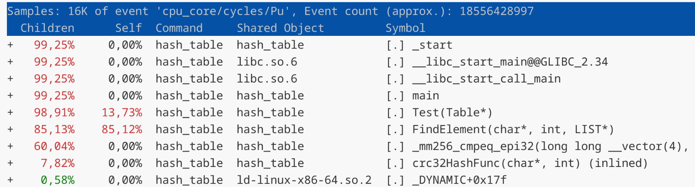
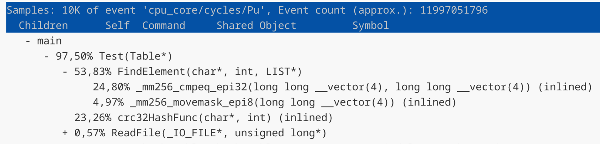

# HashTable

## Описание
Задача работы оптимизировать хеш-таблицу с завышенным **load-factor**. Будем использовать метод цепочек для решения коллизий. Для данной реализации лучшую производительность дает load-factor в диапазоне $[1,3]$. Мы будем использовать хеш-таблицу с load-factor равным $15$. Use-case для оптимизации будет являться одна загрузка данных в таблицу и большое количество поиска слов. В хеш-таблице помимо самих слов будет лежать и количество их повторений, т.е. получится частотный словарь. В качестве данных для хеширования будем использовать произведение "Война и мир". В качестве данных для запросов будем использовать системный файл *linux.words*.

### Характеристики хешируемого текста
| | |
|:-:|:-:|
| Общее количество слов | 562 185 |
| Уникальных слов | 22 259 |

Исходя из этих данных выберем размер таблицы простым числом **1483**, для того чтобы **load-factor** был равен **15**. 

## Исследование хеш-функций
Оцениваем функции по визуально по графикам, а также посчитаем дисперсию высот столбиков по формуле $\mathbb{D}\xi = \mathbb{E}(\xi ^ 2) - (\mathbb{E}\xi)^2$. $\mathbb{E}\xi = 15, \mathbb{E}(\xi ^ 2) = \frac{1}{1483}\sum_{i=1}^{1483} h_i^2.$

### Длина строки.


### Сумма букв строки.


### Murmur хеш.


### Полиномиальный хеш.


### crc32.


| | Хеш функция | $\mathbb{D}\xi$ |
|:--------:|:-----------:|:------:|
| 1 | Длина строки | 32925.14 |
| 2 | Сумма букв | 252.06 |
| 3 | Murmur хеш | 16.03 |
| 4 | Полиномиальный | 15.63 |
| 5 | crc32 | 14.13 |

Остановимся на хеш функции с наилучшими результатами - **crc32**.

## Результаты

Компиляция происходила с флагом $-O3$. Время выполнения измеряется всей программы в тиках процессора с помощью **__rdtsc ()**.

### Запуск 1 (без оптимизаций)
<details>
  <summary>Посмотреть данные</summary>

| | |
|:-:|:-:|
|1 |15577867319|
|2 |15301213455|
|3 |15478795693|
|4 |15534371471|
|5 |16025759884|
|6 |16170633956|
|7 |15429203689|
|8 |15690170853|
|9 |15487844788|
|10 |15916044057|
|11 |15388434672|
|12 |15965180039|
|13 |15333559800|
|14 |15476203922|
|15 |16274301742|
|16 |15550063620|
|17 |15519388196|
|18 |15523332917|
|19 |16433756405|
|20 |15552384009|

</details>

#### Расчеты
$$
\langle t \rangle = \frac{1}{n}\sum_{i=1}^n t_i = 15681425524
$$

$$
\sigma_t = \sqrt{\frac{1}{n}\sum_{i=1}^n (t_i - \langle t \rangle)^2} = 329610593
$$

$$
\sigma_{cp} = \frac{\sigma_t}{\sqrt{n}} = 73703169
$$

$$
t = \langle t \rangle ± 11 * \sigma_{cp}, \epsilon_t = 5,2 \%
$$

$$
t = (15,6 ± 0,8) * 10^9
$$

#### Отчет профилировщика



### Запуск 2 (оптимизация strcmp)

#### Оптимизация (с помощью SIMD инструкций)

```
// исходный
if (!strcmp (list->data[i].str, value))
  return list->data[i].n_repeat;

// оптимизированный
alignas(32) uint8_t buf[32] = {0};
memcpy (buf, value, len % 32);
__m256i vec = _mm256_load_si256 ((__m256i*) buf);

__m256i cmp = _mm256_xor_si256 (vec, list->data[i].avx);
int result = _mm256_testz_si256(cmp, cmp);

if (result == 1)
  return list->data[i].n_repeat;
```

<details>
  <summary>Посмотреть данные</summary>

| | |
|:-:|:-:|
|1|12940618975|
|2|12868340568|
|3|12854937667|
|4|12873503059|
|5|12876993436|
|6|13013122809|
|7|12973003112|
|8|13011397975|
|9|13042391247|
|10|13075794135|
|11|12926594777|
|12|13023866235|
|13|13164978278|
|14|12923346114|
|15|13168235747|
|16|13264296157|
|17|13322848879|
|18|13289998540|
|19|13109609876|
|20|12945349433|

</details>

#### Расчеты
$$
\langle t \rangle = \frac{1}{n}\sum_{i=1}^n t_i = 13033461350
$$

$$
\sigma_t = \sqrt{\frac{1}{n}\sum_{i=1}^n (t_i - \langle t \rangle)^2} = 145050594
$$

$$
\sigma_{cp} = \frac{\sigma_t}{\sqrt{n}} = 32434299
$$

$$
t = \langle t \rangle ± 9 * \sigma_{cp}, \epsilon_t = 2,2 \%
$$

$$
t = (13,0 ± 0,3) * 10^9
$$

#### Отчет профилировщика



#### Результаты
Удалось увеличить скорость выполнения на $16,7\%$.
